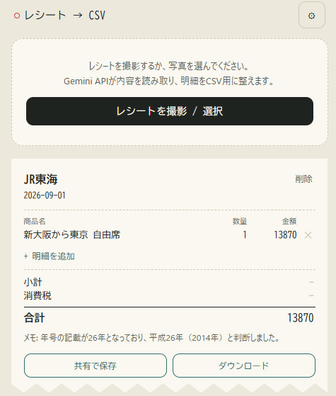

# レシートCSV化（receipt-csv）

レシートを撮影 → Gemini API（Google AI Studio）で内容を読み取り → CSVとして書き出す、iPhone Safari 向けの PWA です。

## URL

[レシートCSV化](https://gearsns.github.io/ReceiptCsv/index.html)

※使用にはAPIキーが必要です。  
「 APIキー・モデルの設定」よりAPIキーの設定を行ってください。  



## 環境

- 環境: TypeScript + SolidJS + Vite + pnpm
- 形式: PWA（ホーム画面に追加してオフラインでも起動可能）
- 対象: iPhone Safari
- AI: Google AI Studio の Gemini API（画像入力対応モデル）
- APIキー・モデル名: アプリ内の「設定」画面から入力します（コードには含まれていません）

## セットアップ

```bash
pnpm install
pnpm dev
```

`http://localhost:5173` が開きます。iPhone実機でカメラ撮影まで試す場合は、後述の「iPhoneで確認する」を参照してください。

## APIキー・モデルの設定

1. アプリ右上の歯車アイコンをタップして設定画面を開く
2. [Google AI Studio](https://aistudio.google.com/apikey) で発行したAPIキーを入力
3. 「一覧を更新」をタップすると、そのAPIキーで使えるモデルをGoogle AI StudioのListModels APIから自動取得し、ドロップダウンに表示します（埋め込み・音声・画像生成専用など画像入力に使えないモデルは除外済み）
4. ドロップダウンから使いたいモデルを選択（一覧にないモデルIDを直接指定したい場合は「モデル名を直接入力する」で手入力に切り替え可能）
5. 「保存する」をタップ

APIキーを変更したときは、再度「一覧を更新」を押すとそのキーで使えるモデルに更新されます。

設定値は端末内の `localStorage` にのみ保存され、レシート画像はブラウザから直接 Gemini API に送信されます（自前のサーバーは経由しません）。

> **セキュリティに関する注意**: このアプリはクライアントサイドのみでAPIキーを扱う構成のため、ブラウザの開発者ツール等からキーが閲覧できてしまいます。自分専用の端末で使う分には問題になりにくいですが、他人と共有する・公開ドメインで配布する場合は、Google Cloud側でAPIキーにリファラー制限をかける、または簡易的なプロキシサーバーを用意してキーをサーバー側に隠す構成に変更することを推奨します。

## ビルド

```bash
pnpm build
pnpm preview
```

`pnpm build` で `dist/` に静的ファイル一式（Service Worker・manifest 含む）が出力されます。そのまま任意の静的ホスティング（Vercel / Netlify / Cloudflare Pages / GitHub Pages など）にデプロイできます。

PWAとして正しく動作させるには **HTTPS配信が必須**です（`localhost` は例外として動作します）。

## iPhoneで確認する

1. `dist/` をHTTPSでホスティングする（開発中に実機で試したい場合は `pnpm dev -- --host` で起動し、Macとテザリング/同一Wi-Fiで `pnpm dev --host` のURLにアクセスするか、[ngrok](https://ngrok.com/) 等でHTTPSトンネルを張ってください）
2. Safari でそのURLを開く
3. 共有ボタン → 「ホーム画面に追加」
4. ホーム画面のアイコンから起動するとアドレスバーのない独立アプリとして動作します

「レシートを撮影 / 選択」ボタンは `<input type="file" capture="environment">` を使っているため、標準のカメラアプリ／写真アプリの選択シートがそのまま開きます。

## 使い方

1. 「レシートを撮影 / 選択」で写真を撮る、またはカメラロールから選ぶ
2. Gemini APIが解析し、店舗名・日付・明細・小計・消費税・合計を読み取ってカードに表示
3. 読み取り結果はその場で編集可能（店名・日付・各明細の数量や金額、合計欄など）
4. 各レシートカード・画面下部の一括書き出しどちらにも保存方法が2つあります
   - **共有で保存**: iOS標準の共有シートを開き、「"ファイル"に保存」「AirDrop」「Slackに送る」など好きな保存先を選べます（共有APIが使えない環境では自動的にダウンロードにフォールバックします）
   - **ダウンロード**: 共有シートを経由せず、ブラウザの標準ダウンロード動作でそのままファイルとして保存します（Safariの設定次第で「ダウンロード」フォルダやその都度の保存先選択になります）

読み取った内容はすべて端末内の `localStorage` に保存されるため、アプリを閉じても一覧は残ります（ブラウザのデータ消去やアンインストールで消えます）。

## 主なファイル構成

```
src/
  App.tsx                 画面全体の状態管理・組み立て
  app.css                 デザイントークン / スタイル
  types.ts                型定義
  lib/gemini.ts           Gemini API呼び出し（構造化出力）
  lib/csv.ts              CSV生成・保存（共有シート対応）
  lib/storage.ts          設定・レシートのlocalStorage永続化
  components/SettingsPanel.tsx  APIキー・モデル設定画面
  components/ReceiptCard.tsx    レシート表示・編集カード
public/icons/              PWAアイコン一式
vite.config.ts             vite-plugin-pwa 設定
```

## CSVの列

```
店舗, 日付, 商品名, 数量, 単価, 金額
```

各レシートの末尾に小計・消費税・合計の行が付きます（値が無い項目は空欄になります）。Excelでも文字化けしないよう UTF-8 BOM 付きで出力しています。
